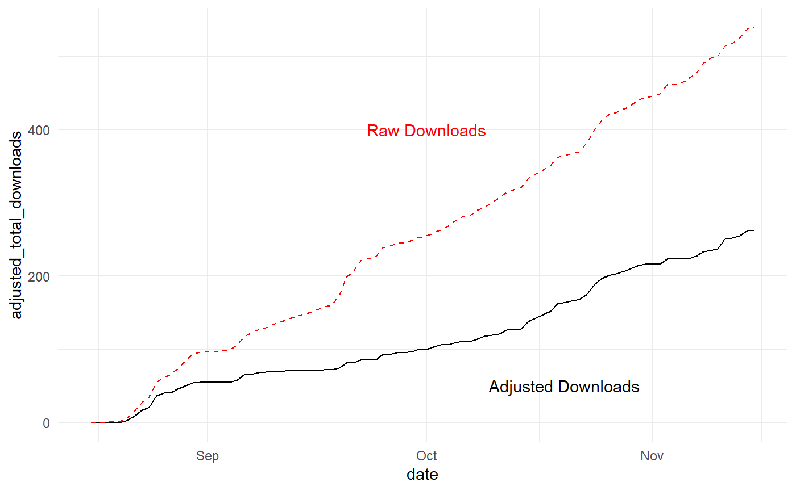

adjustedcranlogs
================

[](http://cran.r-project.org/package=adjustedcranlogs)

 <meta property="og:image" content=="man/images/adjustedcranimage.png" />

Overview
--------

**adjustedcranlogs** is a wrapper around the **cranlogs** package that removes CRAN-wide shared daily downloads and re-download/CRAN mirror spikes due to package updates.

Installation
------------

``` r
# To install: 
install.packages("adjustedcranlogs")

# To install developmental version:
# install.packages("devtools")
devtools::install_github("tylermorganwall/adjustedcranlogs")
```

Function (there's only one)
---------------------------

-   `adj_cran_downloads()` Wrapper around **cranlogs** function `cran_downloads()`. Works the same, but returns a data frame showing the adjusted downloads, adjusted total downloads, shared minimum downloads, and package update information.

Usage
-----

``` r

library(adjustedcranlogs)
library(ggplot2)
library(dplyr)
library(lubridate)

mypkgdownloads = adj_cran_downloads("skpr",from = "2017-08-15", to = "2017-11-15")

mypkgdownloads %>%
  ggplot() + 
  geom_line(aes(x=date,y=adjusted_total_downloads)) +
  geom_line(aes(x=date,y=total_downloads),color="red",linetype="dashed") +
  annotate("text",y=400,x=dmy("01-10-2017"),label="Raw Downloads",color="red") +
  annotate("text",y=50,x=dmy("20-10-2017"),label="Adjusted Downloads",color="black") +
  theme_minimal()
```


